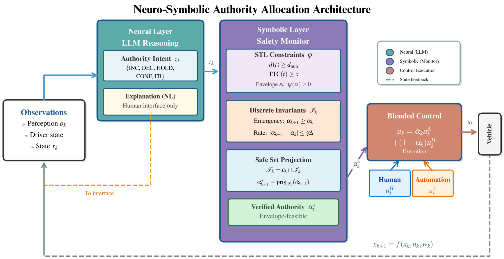

# 🧠🤝 Neuro-Symbolic Authority Allocation

## 🧾 Overview
This repository contains a research implementation of neuro-symbolic authority allocation for shared control in a longitudinal car-following scenario with an emergency braking event. At each discrete simulation step, an authority variable **$\alpha_k \in [0,1]$** blends automation and human control inputs, enabling dynamic shifts of control priority as safety risk changes. The code evaluates three strategies: **(i)** a Classical baseline that updates authority using hand-crafted risk thresholds, **(ii)** an LLM-only baseline that converts intent recommendations into authority updates without a formal safety monitor (but with a nominal authority floor to avoid collapse under stochastic human input), and **(iii)** a Neuro-Symbolic (NeSy) method that applies an invariant projection layer to enforce constraints such as bounded rate of change, emergency/violation non-decreasing authority, and safety-aware authority floors. LLM calls are optionally throttled via `--llm-period`, reusing the last intent between calls. The simulator logs full time-series trajectories (states, safety signals, control actions, and authority) and aggregates quantitative metrics for comparison across methods. Runs are deterministic for a fixed seed to support consistent evaluation and repeatable experiments.


## 🏗️ System Architecture

<div align="center">
  
</div>

The diagram above illustrates the neuro-symbolic authority allocation framework, showing how LLM-generated intents are processed through an invariant projection layer to ensure safety constraints while dynamically adjusting authority between automation and human control.

## 🗂️ Repository Structure
- `main.py` — Runs the simulation suite and writes outputs  
- `src/vehicle.py` — Vehicle state, discrete-time dynamics, safety metric computation  
- `src/controllers.py` — Automation controller (PD car-following) and human controller (delay + noise)  
- `src/stl_monitor.py` — Robustness proxy utilities and aggregate statistics  
- `src/authority_allocator.py` — Authority allocators (Classical / LLM-only / NeSy) and invariant projection  
- `src/llm_interface.py` — `AuthorityIntent` schema and mock intent generator  
- `src/simulator.py` — Scenario runner and time-series trajectory logging  
- `src/visualization.py` — Plot generation and export  
- `tests/` — Unit tests for dynamics, safety metrics, and monitoring utilities  

## 📦 Dependencies
Key packages:
- Python (3.9 recommended)
- `numpy`
- `matplotlib`
- `pytest`

Optional:
- `rtamt` (only if extending the monitoring layer beyond the current robustness proxy)

## 🏁 Running

From the project root (the folder that contains `main.py`), run:
```bash
python main.py --seed 0 --outdir output
```

**What this does:**
- Runs all three baselines: `classical`, `llm_only`, `nesy`
- Uses a deterministic random seed (repeatable results)
- Writes artifacts into the folder you specify (`output/`)

### Common variants

**1) Change the random seed**
```bash
python main.py --seed 7 --outdir output
```

**2) Change simulation length / timestep**
```bash
python main.py --horizon 60 --dt 0.05 --outdir output
```

**3) Tune safety + authority parameters**
```bash
python main.py --d-min 12 --tau-emerg 1.5 --gamma 0.4 --eta 0.25 --outdir output
```

**4) Set initial/nominal authority (alpha0)**

`alpha0` is used as the initial authority value and also serves as a nominal authority floor to prevent the LLM from collapsing authority to 0 under stochastic human control.

```bash
python main.py --alpha0 0.2 --outdir output
# example: more conservative (keeps more automation authority)
python main.py --alpha0 0.4 --outdir output
```

**5) Disable figure or CSV outputs (faster runs)**
```bash
python main.py --no-fig --outdir output
python main.py --no-csv --outdir output
```

### LLM backend selection

**Mock (default / fastest)**
```bash
python main.py --llm-backend mock --outdir output
```

**OpenAI API (uses OPENAI_API_KEY)**
```bash
export OPENAI_API_KEY="YOUR_KEY"
python main.py --llm-backend openai --llm-model gpt-4.1-mini --outdir output
```

*Note: Some OpenAI models have different parameter constraints. If a model errors, try `gpt-4.1-mini` first (known to work cleanly in this project).*

**Offline Hugging Face (must already be cached)**
```bash
python main.py --llm-backend hf --llm-model meta-llama/Llama-3.1-8B --outdir output
# or
python main.py --llm-backend hf --llm-model google/gemma-2-9b-it --outdir output
```

**Reduce LLM calls (important for OpenAI/offline 8B/9B)**
```bash
python main.py --llm-backend openai --llm-model gpt-4.1-mini --llm-period 2.0 --outdir output
```

**Verbose LLM logging (prove it's being used)**
```bash
python main.py --llm-backend openai --llm-model gpt-4.1-mini --llm-verbose --outdir output
```

### Troubleshooting

- **If Python can't import src.***, run from the repo root (check that `main.py` and `src/` are present): `ls main.py src`
- **If OpenAI mode feels "stuck"**, increase `--llm-period` (fewer calls), or use mock/offline HF
- **If LLM-based baselines look unsafe**, raise `--alpha0` (keeps a nominal authority floor), and/or reduce `--llm-period` jitter by calling less often
- **If offline HF runs slow**, your machine is likely CPU/offloading; try 4-bit quantization support (`bitsandbytes`) or use a GPU

## 📤 Outputs

The program writes artifacts to the selected output directory (default: `output/`):

- `metrics.json` — Per-baseline summary metrics with keys:
  - `rho_min`
  - `satisfaction_rate`
  - `collisions`
  - `takeovers`
  - `monotonicity_violations`
  - `total_variation`
  - `jerk_max`

- `timeseries_classical.csv`
- `timeseries_llm_only.csv`
- `timeseries_nesy.csv`

Each CSV contains:  
`t, x_ego, v_ego, a_ego, x_lead, v_lead, a_lead, distance, ttc, emergency, robustness, alpha, u_auto, u_human, u_blend`

- `figure.png` — A saved visualization artifact (PNG)

All outputs are deterministic for a fixed seed.

## 🧪 Testing

- `tests/test_vehicle.py` — Vehicle dynamics, TTC/emergency logic, lead profile behavior  
- `tests/test_monitor.py` — Robustness and aggregate monitoring utilities  

Run tests:
```bash
pytest -q
```

## 📧 Contact
For questions or issues: safayat.b.hakim@gmail.com

## 📝 Notes
This codebase is intended as a compact research implementation aligned with an accompanying paper.
